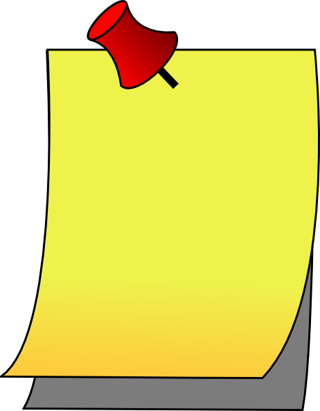
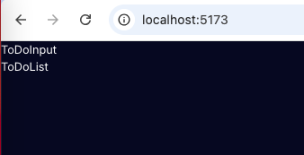

# About React + Vite App Template

This template provides a minimal setup to get React working in Vite with HMR and some ESLint rules and its deployed onto:

* [@netlify](https://brightvibesrock-todolist.netlify.app/)

I created this template because it super easy to just clone a repo and then make your custom updates, but this project has great foundation to understand reactjs folder structure, components and  how things are linked together, Also, the template has the basic code for developing reactjs cards that can easily be ported to your other apps!

Currently, there are 2 official plugins are available:

* [@vitejs/plugin-react](https://github.com/vitejs/vite-plugin-react/blob/main/packages/plugin-react/README.md) uses [Babel](https://babeljs.io/) for Fast Refresh
* [@vitejs/plugin-react-swc](https://github.com/vitejs/vite-plugin-react-swc) uses [SWC](https://swc.rs/) for Fast Refresh

## Table of Contents
<details>

<summary>click to expand contents</summary>

- [How to read this document](#how-to-read-this-document)
- [Prerequisites](#prerequisites)
- [Advanced Developers](#advanced-developers)
- [Getting Started 101](#getting-started-101)
- [Let's Get Coding](#lets-get-coding)
- [Get style](#get-your-style)
- [Run Deploy your app](#deploy-your-app)
- [Acknowledgements](#acknowledgements)
- [Resources](#resources)


</details>

## How to read this document:

 **Attention:** Coding challenge here, don't worry, you can always check the code in this repo if you are not sure!

 **Note:** Note(s) help you to navigate this repo template.

 **Tip:** Something you should know that will help you to be a better reactjs front end developer

## Prerequisites:

* github Desktop & github.com Account
  
* VSCode 
  * VSCode Extension: ES7 React/Redux/GraphQL/React-Native snippets
    
* Open command line terminal and cd your project directory. This is where you will install any packages for the collection of apps you will create over time. En`ter the following to install npm, you can skip this step if you already have it. You should have version 20.x or higher.

* Create a project directory call reactjstodolist.
  
* [@netifly account.](https://app.netlify.com)

* from terminal, cd to your reactjstodolist folder.
  
## Advanced Developers
If you are already familiar with reactjs, folder structures and props, below are quick steps to  deploy it to netlify. If you are new to reactjs or you just want to refresh on core concepts go to the section -> [Getting Started 101](#getting-started-101).

### Get site running on local and deploy to netlify
All the code for the 101 is here https://github.com/brightvibesrock/reactjs-todo-101 for your reference.

* `remove package-lock.json`

* `npm i install`

* `npm -v`

* `npm run dev`

* stop site from running `ctrl-c`

In Github Desktop:

* Connect your github Cloud Account to Github Desktop.

* Choose `add existing repo", select app repo folder, select  create a repository, enter any description, elect to make repo  public if desired, publish repository!`

* Go to your github Account/Repositories, you should see your newly published repo!

* Go to your Netlify Account and login with your github Account..

* Choose `add new site: import an existing project: deploy with github and authenticate your project.`

* Accept all defaults and deploy, if you are currently checked out on a branch vs main you will see that branch. 

* Customize your `custom domain` from domain management, consider naming your github :account name-reacttodlist". If you do not set this, link will be a randomized alpha numeric name.
  
* Netlify site is created, `go to the link` Add this live link to you repo!

## Getting Started 101:
####  Time: 5 - 15 Minutes

* From the VSCode Terminal, create your app by entering:

`npm create vite@latest reactjstodolist`

 **Note:** Choose react and javascript from the install prompt. Replace reactjstodlist with whatever your AppName.

Change to the app dirkectory that you just generated:

`cd reactjstodolist`

 **Note:** Replace reactjstodolist with your AppName. 

 **Tip:** Below is some information on the App folder structure:

* Automatically generated files that you don't usually update:
  * eslint.config.js
  * vite.config.js
* Automatically generated files that you can customize a bit:
  * package.json -> automatically created and contains all your dependencies, this will get updated as you install new packages
  * .gitignore -> contains all the files that will be exclude from build, things like node_modules, local vars, automatic updated files
* Automatically generated folders and files where you will make significant changes:
  * index.html -> this is the homepage
  * README.md -> you can update this to tell others about your repo and how to contribute or use
  * public -> publicly shared files like images and fonts
  * src -> app source code

### Delete the following
* App.css
### Create the following folders:
* public/fonts //pulic are things shared like images and fonts
* public/images
* src/components

### Create the following files:
* src/components/ToDoCard.jsx
* src/components/ToDoInput.jsx
* src/components/ToDoList.jsx

## Let's get coding!
####  Time: 30 minutes to 1 Hour

This section is a step-by-step that explains everything in detail. If you are new to reactjs it is very helpful so that when you git clone http://xxx, you can understand how to customize the app without making breaking changes.

### Creating your and updating your components:
* We are going update code for all of our components.
* Open up ToDoIput.jsx, its an empty file now, type in rfc and select rfc from the prompt.

 **Tip:** The ES7 extension you added earlier allows you to have this nifty trick to quickly boostrap your code!

Below is the code that is inserted:

`reacttodolist/src/components/ToDoInput.jsx`

```
import React from 'react'

    export default function ToDoInput() {
    return (
        <div>
        
        </div>
    )
    }
```

* Update the function by adding ToDoInput between `<div><div>` tags.

`reacttodolist/src/components/ToDoInput.jsx`

```
import React from 'react'

export default function ToDoInput () {
  return (
    <div>
      ToDoInput
    </div>
  )
}
```
* Open App.jsx file and update code so it looks like below. We add import statements to reference sub-components of ToDoList and TodoInput. We update the `<div></div>` to `<main></main>`. Also, we add those components in between `<main></main>` tags. All the reactjs wizardry happens inside App.
  
 **Tip:** `The <main></main>` tags reference main.jsx. The main component is considered the highest level parent component for this app.


`reacttodolist/src/components/App.jsx`

```
import ToDoInput from "./components/ToDoInput"
import ToDoList from "./components/ToDoList"

function App() {

  return (
    <main>
       <ToDoInput/>
       <TodDoList/>
    </main>
  )
}

export default App
```

### Your code challenge!
 **Attention:** Updatee ToDoList and ToDoCard sub-components. Hint: Its basically identical to ToDoInput.jsx, but the sub-component name between the `<div></div>` tags will match the component name of the file! 

<details>

<summary>click to view the code</summary>

`reactjstodolist/ToDoList`
```

export default function ToDoList() {
  return (
   <div>
      ToDoList
   </div>
  )
}

```

`reactjstodolist/TodoCard`

```
import React from 'react'

export default function ToDoCard() {
  
  return (
    
    <ToDoList>

      <ToDoCard/>
    
    </ToDoList>
  )
}
```

</details>

### Download Google fonts to public/fonts folder

* Go to https://fonts.google.com/
`* search and select "get font" to add to you cart.
    * Inter
    * Press Start 2P
    * go to your cart and copy the embedded links.
    * update meta info in the index.html file so it looks like this:

`reacttodolist/index.html`

```
<!doctype html>
<html lang="en">
  <head>
    <meta charset="UTF-8" />
    <link rel="icon" type="image/svg+xml" href="/vite.svg" />
    <meta name="viewport" content="width=device-width, initial-scale=1.0" />
    <link rel="preconnect" href="https://fonts.googleapis.com">
    <link rel="preconnect" href="https://fonts.gstatic.com" crossorigin>
    <link href="https://fonts.googleapis.com/css2?family=Inter:ital,opsz,wght@0,14..32,100..900;1,14..32,100..900&family=Press+Start+2P&display=swap" rel="stylesheet">
    
    <title>To Do App</title>
  </head>
  <body>
    <div id="root"></div>
    <script type="module" src="/src/main.jsx"></script>
  </body>
</html>
```

 **Tip:**  The code that is between the `<head></head>` tags is the meta information for your app.

Let's review the relationship of how things are rendered. The main parent component renders App component; App component renders sub-component(s) ToDoInput and ToDoList and then the sub-component ToDoList renders sub-component ToDoCard.

The file structure is below:
```
|index.html|    -> ||main||
||main||        -> |||App|||
|||App|||       -> ||||ToDoInput||||
|||App|||       -> ||||ToDoList||||
||||ToDoList||| -> ||||ToDoCard||||
```

* Update main.jsx to fetch the App component by adding App in between the `<div></div>` tags via the the Id of 'root'. Add import for React and ReactDOM. The main component is rendered through index.html. All that reactjs code is thrown as html! See below code:

`reactjstodolist/main.jsx`

```
import React from 'react'
import ReactDOM from 'react-dom/client'
import App from './App.jsx'
import './index.css'

ReactDOM.createRoot(document.getElementById('root')).render(
  <React.StrictMode>
    <App />
  </React.StrictMode>
)
```

## Get your style!

* Copy and paste index.css style code from this repo to your index.css file. Make note of the import statement in main.jsx
`import './index.css'`, this helps to connect the styles to the app.


## Deploy your app!
* just to make sure you have nothing corrupt when you first created the app, we are got to run npm install.

`cd reactjstodolist`

`npm install`

Then deploy to local dev.

`npm run dev`

Grab the local host path 
-> `http://localhost:5173/` and paste into your browser.

 **Note:** It should look like below:

 

From this point forward, go to Advance Developer section at the beginning of the readme and clone this repo to deploy to netlify!

Also note that the original project is here, but it doesn't really explain all the ins/outs unless you watch his you tube channels. Enjoy!

## Acknowledgements
* James Jamezca: GitHub Repo: https://github.com/jamezmca. He is a total front-end boss! If you are beginner or just need to solidify on some foundations... check out the resources below.

## Resources

* VSCode - https://code.visualstudio.com/
* James Jamezca - his original code: https://github.com/jamezmca/reactjs-todolist
* James Jamezcal awesome reactjs tutorials! https://www.youtube.com/watch?v=82PXenL4MGg
* NodeJS - https://nodejs.org/en/download
* Vite - https://vitejs.dev/guide/
* https://fonts.google.com/
* https:favp ng.com
* FontAwesome CDN - https://cdnjs.com/libraries
* FontAwesome Icons - https://www.fontawesome.com
* Netlify - https://www.netlify.com
* https://fonts.google.com/
  
